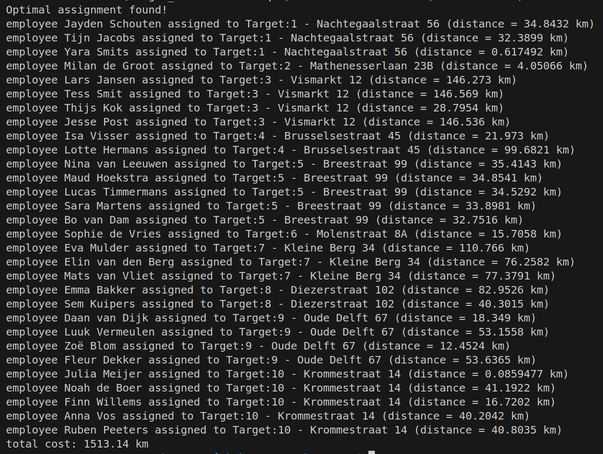

# vrp

trying to solve constrained assignment optimization for EC field work.

converts human readable addresses of both the target and the employees' addresses into geolocations. Then tries to calculate the shortest distance for all combinations of locations + batches of employees. For example: if 4 out of the 50 employees have to attend at a location, then the remaining resources have to be as efficient as possible for the rest of the assignments of that evening/night etc.

Distance between employee and target won't be entirely accurate since it's calculated with haversine formula, but should be adequate enough given the extensive road network in my country.

Once all the necessary information is gathered, OR-tools from google are used to calculate the optimal combination. Currently it searches for the least amount of kilometers (nice for the employer), but with some tweaks to the code an alternative of least amount of average kilometers for every employee should also be possible (nice for the employees).

#### dependencies
- cpr
- nlohmann/json
- [google or-tools](https://developers.google.com/optimization/install/cpp/binary_linux)
- [locationiq](https://locationiq.com/) api key - the free tier of this api has a rate limit of 2 requests/s and 5000 requests/day. 

In my case cpr and nlohmann/json were installed with vcpkg and or-tools was installed manually in the home directory.
The api key needs to be retrievable from env. In the case of linux: 'export LIQ_API_KEY="..."' inside .bashrc