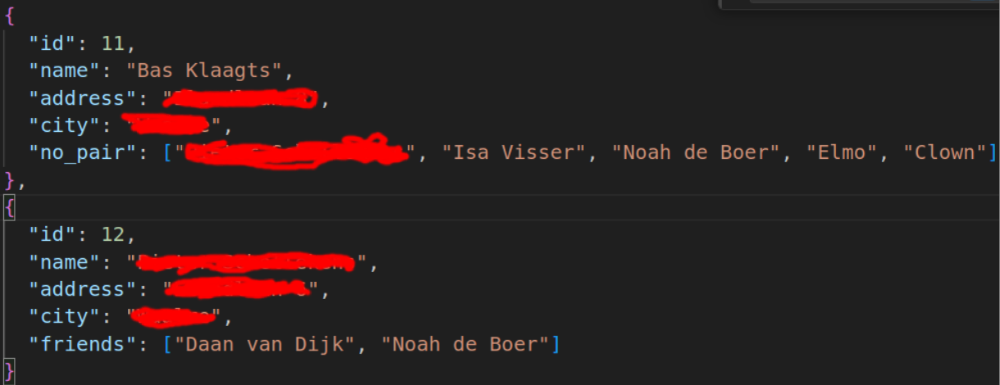

# vrp

trying to solve constrained assignment optimization for EC field work.

converts human readable addresses of both the target and the employees' addresses into geolocations. Then tries to calculate the shortest distance for all combinations of locations + batches of employees. For example: if 4 out of the 50 employees have to attend at a location, then the remaining resources have to be as efficient as possible for the rest of the assignments of that evening/night etc.

Distance between employee and target won't be entirely accurate since it's calculated with haversine formula, but should be adequate enough given the extensive road network in this country.

Once all the necessary information is gathered, OR-tools from google are used to calculate the desired computation. Currently it has an option that searches for the combination that leads to the least amount of kilometers travelled: "assignEmployees" and another option to get a more balanced distribution, with less strong outliers, but this will lead to an overall longer distance travelled: "assignEmployeesBalanced".

Another option is using "assignEmployeesEnemiesAndFriends" which tries to keep track of employee enemies and friends. People they don't want to be on location with together and people who should be heavily favored to be on the same location. This could be in case of available means of transportation or because they're very picky and can only stomach a few colleagues. This is achieved by making another constraint in the assignment function, deducting the FAVOR_COEFFICIENT from the total kilometers that will need to be travelled in an assignment when 2 friends are assigned on location together. So as an example: Bob and Doyle are friends, when they are paired together on the same location, the cost (total km) will be lowered by 100km or whatever the coefficient's set to. This also means we have to manually sum up the total km of an assignment made this way, since the objective->Value() will no longer be accurate. 

#### dependencies
- cpr
- nlohmann/json
- [google or-tools](https://developers.google.com/optimization/install/cpp/binary_linux)
- [locationiq](https://locationiq.com/) api key - the free tier of this api has a rate limit of 2 requests/s and 5000 requests/day. 

In my case cpr and nlohmann/json were installed with vcpkg and or-tools was installed manually in the home directory.
The api key needs to be retrievable from env (with std::getenv("LIQ_API_KEY")). In my case I added the following to 
.basrc: 'export LIQ_API_KEY="..."' The executable is made with CMake. 

#### future TODOs
- make something of a GUI
- cache lon/lats from employees so the program is bottlenecked less by the api request rate limit
- export the assignments into a document.
- add support for assigning an employee twice on the same day (evening + night shift)